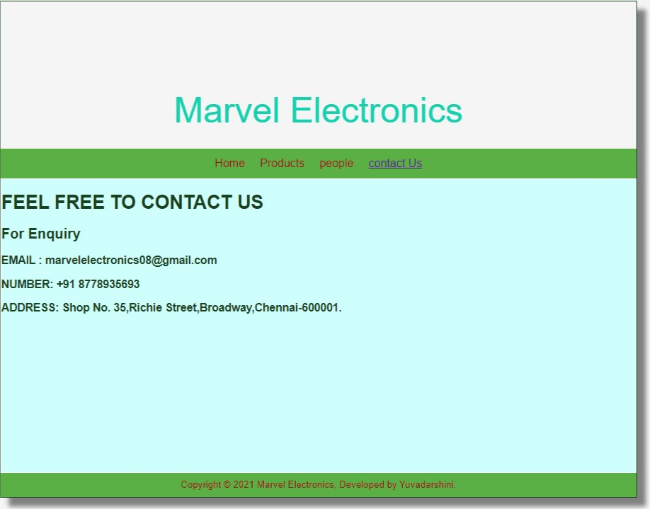
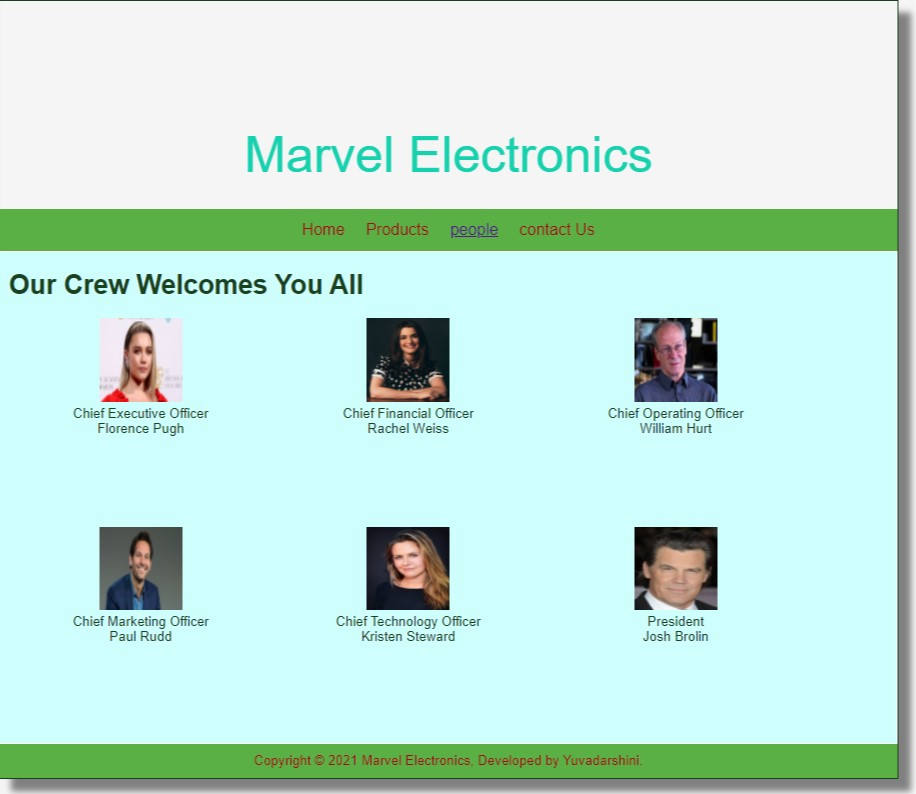
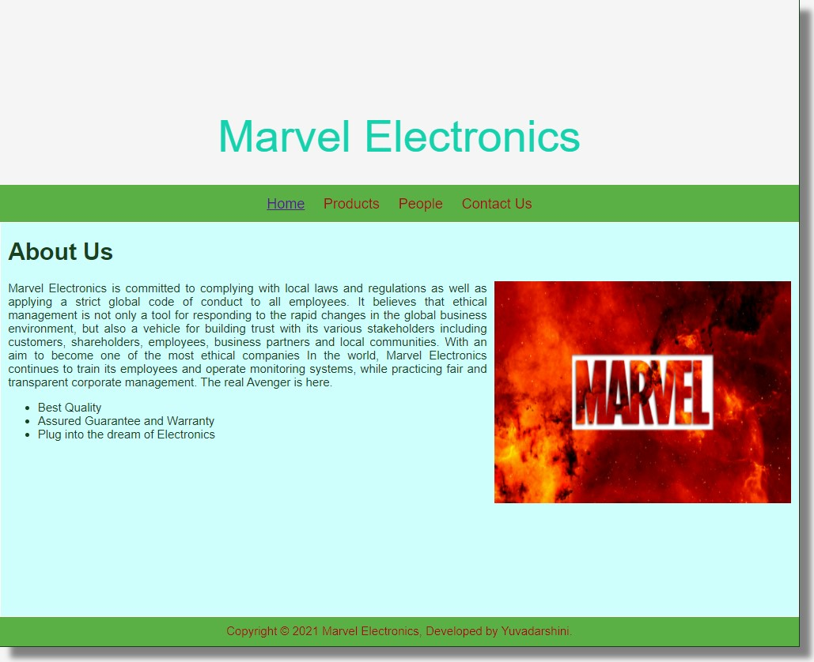
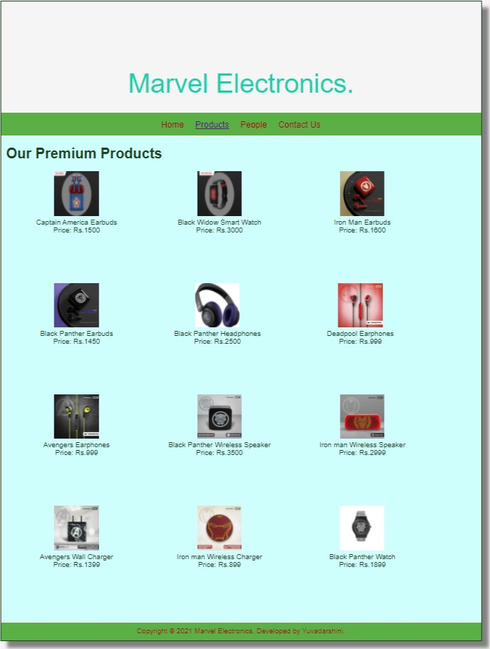

# Web Design for a Software Product Company

## AIM:

To design a static website for a software product company company.

## DESIGN STEPS:

### Step 1:

Requirement collection.

### Step 2:

Creating the layout using HTML and CSS.

### Step 3:

Updating the sample content.

### Step 4:

Choose the appropriate style and color scheme.

### Step 5:

Validate the layout in various browsers.

### Step 6:

Validate the HTML code.

### Step 6:

Publish the website in the given URL.

## PROGRAM :

### Homepage

~~~
<!DOCTYPE html>
<html lang="en">
  <head>
    <title>Marvel Electronics</title>
    <link rel="stylesheet" href="./css/layout.css" />
    <link rel="icon" href="./img/black.png" type="image/x-icon" />
  </head>

  <body>
    

      
Marvel Electronics

      

        
<a href="/static/home.html">Home</a>

        
<a href="/static/products.html">Products</a>

        
<a href="/static/people.html">People</a>

        
<a href="/static/contact Us.html">Contact Us</a>

      

      

        

          <h1>About Us</h1>
          
          

            Marvel Electronics is committed to complying with local laws and regulations as well as applying a strict global code of conduct to all employees. It believes that ethical management is not only a tool for responding to the rapid changes in the global business environment, but also a vehicle for building trust with its various stakeholders including customers, shareholders, employees, business partners and local communities. With an aim to become one of the most ethical companies In the world, Marvel Electronics continues to train its employees and operate monitoring systems, while practicing fair and transparent corporate management.
            The real Avenger is here.
            <ul>
              <li>Best Quality</li>
              <li>Assured Guarantee and Warranty</li>
              <li>Plug into the dream of Electronics</li>
            </ul>
          

        

      

      

        Copyright &#169; 2021 Marvel Electronics, Developed by Yuvadarshini.
      

    

  </body>
</html>
~~~

### People

~~~
<!DOCTYPE html>
<html lang="en">
    <head>
        <title>Marvel Electronics</title>
        <link rel="stylesheet" href="./css/layout.css" />
        <link rel="icon" href="./img/black.png" type="image/x-icon" />
    </head>
    <body>
        

            
Marvel Electronics

            

                
<a href="/static/home.html">Home</a>

                
<a href="/static/products.html">Products</a>

                
<a href='/static/people.html'>people</a>

                
<a href='/static/contact Us.html'>contact Us</a>

            

            

                

                    <h1>Our Crew Welcomes You All</h1>
                    

                        

                            

                                
                            

                            
Chief Executive Officer

                            
Florence Pugh

                        

                        

                            

                                
                            

                            
Chief Financial Officer

                            
Rachel Weiss

                        

                        

                            

                                
                            

                            
Chief Operating Officer

                            
William Hurt

                        

                        

                            

                                
                            

                            
Chief Marketing Officer

                            
Paul Rudd

                        

                        

                            

                                
                            

                            
Chief Technology Officer

                            
Kristen Steward

                        

                        

                            

                                
                            

                            
President

                            
Josh Brolin

                        

                    

                

            

            

                Copyright &#169; 2021 Marvel Electronics, Developed by Yuvadarshini. 
            

        

    </body>
</html>
~~~

### Products

~~~
<!DOCTYPE html>
<html lang="en">
  <head>
    <title>Marvel Electronics</title>
    <link rel="stylesheet" href="./css/layout.css" />
    <link rel="icon" href="./img/black.png" type="image/x-icon" />
  </head>

  <body>
    

      
Marvel Electronics.

      

        
<a href="/static/home.html">Home</a>

        

          <a href="/static/products.html">Products</a>
        

        
<a>People</a>

        
<a>Contact Us</a>

      

      

        
    
          <h1>Our Premium Products</h1>
          

              
 
                  

                  
                  

                  
Captain America Earbuds

                  
Price: Rs.1500

              

              
 
                  

                  
                  

                  
Black Widow Smart Watch

                  
Price: Rs.3000 

              

              
 
                

                
                

                
Iron Man Earbuds

                
Price: Rs.1600 

              

              
 
                

                
                

                
Black Panther Earbuds

                
Price: Rs.1450

              

 
                

                
                

                
Black Panther Headphones

                
Price: Rs.2500

              

              
 
                

                
                

                
Deadpool Earphones

                
Price: Rs.999 

              

              
 
                

                
                

                
Avengers Earphones

                
Price: Rs.999 

              

              
 
                

                
                

                
Black Panther Wireless Speaker

                
Price: Rs.3500 

              

              
 
                

                
                

                
Iron man Wireless Speaker

                
Price: Rs.2999 

              

              
 
                

                
                

                
Avengers Wall Charger

                
Price: Rs.1399 

              
 
              
 
                

                
                

                
Iron man Wireless Charger

                
Price: Rs.899 

              

              
 
                

                
                

                
Black Panther Watch

                
Price: Rs.1899 

              

          

          
        
      

      

        Copyright &#169; 2021 Marvel Electronics, Developed by Yuvadarshini.
      

    

  </body>
</html>
~~~

### Contact

~~~
<!DOCTYPE html>
<html lang="en">
    <head>
        <title>Marvel Electronics</title>
        <link rel="stylesheet" href="./css/layout.css" />
        <link rel="icon" href="./img/black.png" type="image/x-icon" />
    </head>

    <body>
        

            
Marvel Electronics

            

                
<a href="/static/home.html">Home</a>

                
<a href="/static/products.html">Products</a>

                
<a href='/static/people.html'>people</a>

                
<a href='/static/contact Us.html'>contact Us</a>

            

            

                

                    <h1>FEEL FREE TO CONTACT US</h1> 
                    

                        <h2>For Enquiry</h2>
                        <h3>EMAIL : marvelelectronics08@gmail.com</h3>
                        <h3>NUMBER: +91 8778935693</h3>
                        <h3>ADDRESS: Shop No. 35,Richie Street,Broadway,Chennai-600001.</h3>
                    

                

            

            

            Copyright &#169; 2021 Marvel Electronics, Developed by Yuvadarshini.
            

        

    </body>
</html>
~~~
### Outpput:

## Result:

Thus a website is designed for the software product company and the HTML,CSS code are validated.
